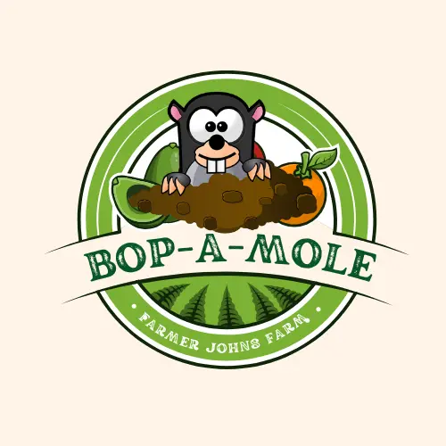
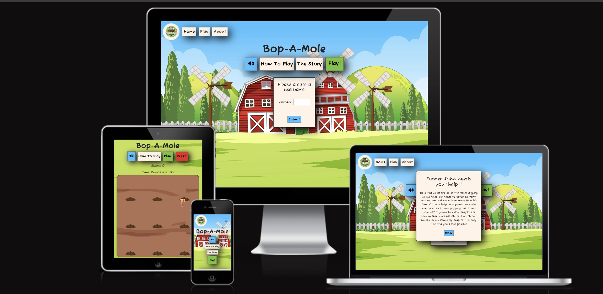
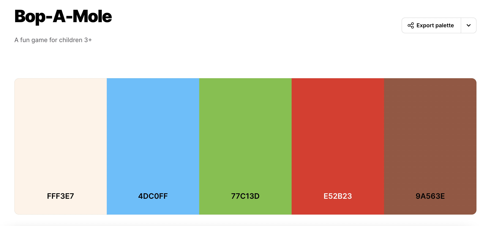
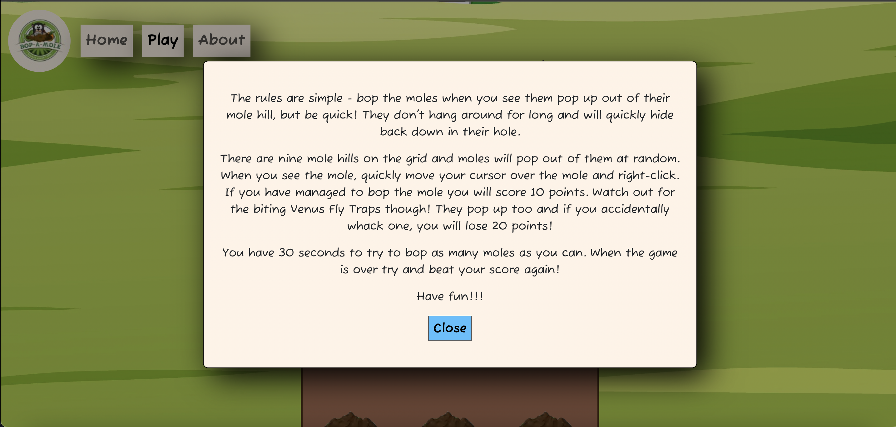
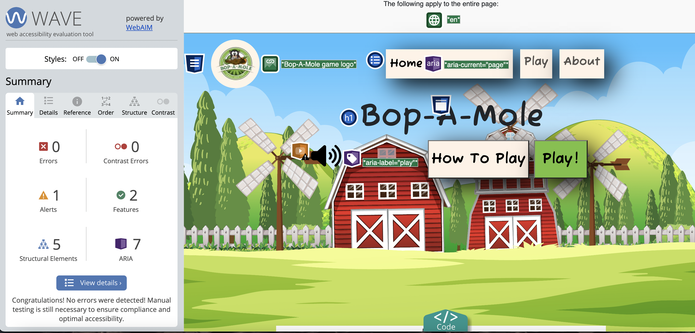
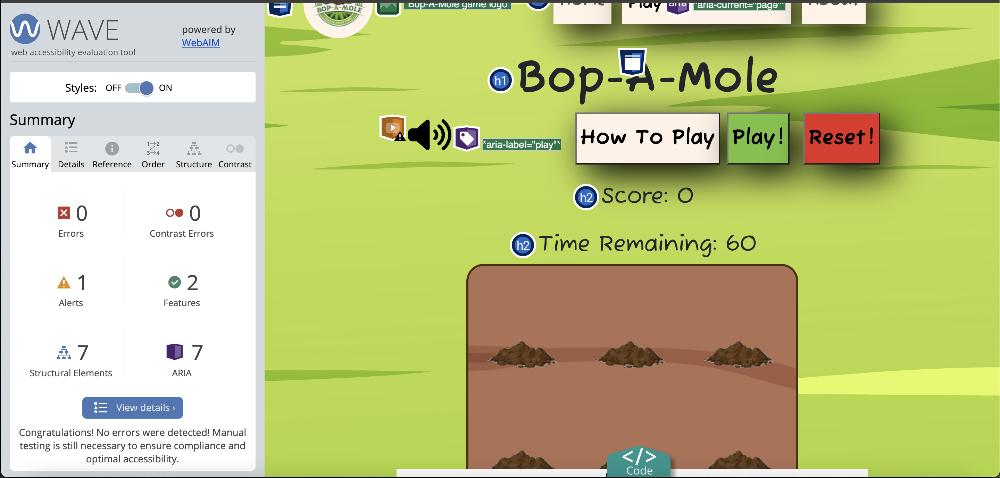
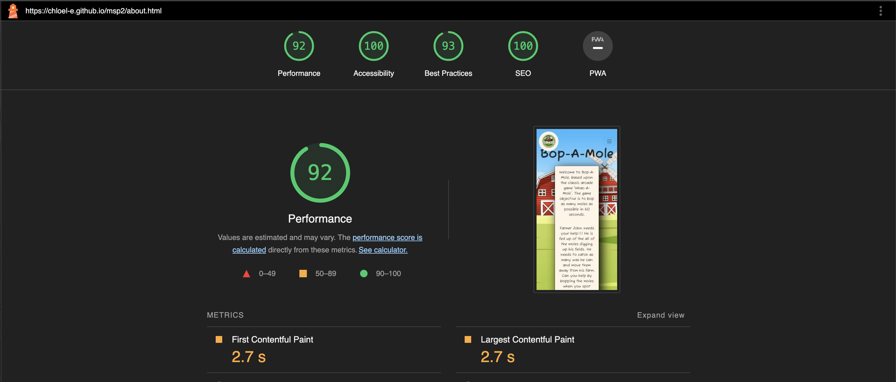

<h1 align="center">Bop-A-Mole</h1>

- - - 

<h2 align="center"></h2>

# Bop-A-Mole

Welcome to Bop-A-Mole, based upon the classic arcade game 'Whac-A-Mole'. The game objective is to bop as many moles as possible in 60 seconds.

It's a simple, fun, high-energy game which involves concentration, visual perception, hand-eye-coordination and reaction time- all great skills for young children to practice and develop in this exciting, interactive online game.

A fictional story has been created to support the theme of the game and make the game more engaging with young children. Farmer John is fed up of the all of the moles digging up his fields. He needs to catch as many was he can and move them away from his farm. Can you help by bopping the moles when you spot them popping out from a mole hole? If you're too slow they'll hide back in their mole hole. Oh, and watch out for the Venus Fly Trap plants, they bite and you'll lose points!

This game has been designed for ages 5+ but is super fun for the whole family. The rules are simple - bop the moles when you see them pop up out of their mole hill, but be quick! They don't hang around for long and will quickly hide back down in their hole.
           
Instead of the standard 5 mole holes, this game has 9 mole hills, making it a bit more challenging. A mole will pop out of one of the 9 mole hills at random. When you spot the mole, quickly move your cursor over the mole and left-click. If you have managed to bop the mole you will score 10 points, which you will see added to your score tally. Watch out for the biting Venus Fly Traps though! They pop up too and if you accidentally whack one, you will lose 20 points!

You have 60 seconds to try to bop as many moles as you can. When the game is over try and beat your score again! Have fun!!!

This game has been built using HTML, CSS and Javascript.

[View the live project here.]( https://chloel-e.github.io/msp2/)

## Contents

* [Languages Used](#languages-used)
* [User Experience](#user-stories)
* [Design](#design)
  * [Color Scheme](#color-scheme)
  * [Typography](#typography)
  * [Imagery](#icons)
  * [Wireframes](#wireframes)
* [Structure](#design)
  * [Features](#features)
  * [Features For The Future](#features-for-the-future)
* [Technologies Used](#technologies-used)
  * [ Frameworks, Libraries & Programs Used](#frameworks-libraries--programs-used)
* [Testing](#testing)
  * [User Experience](#user-experience-ux)
  * [Accessibility](#accessibility)
  * [Deployment](#deployment)
  * [Run locally](#run-locally)
* [Credits](#credits)
* [Acknowledgements](#acknowledgements)

- - - 

## Languages Used

*  [HTML5](https://en.wikipedia.org/wiki/HTML5)
*  [CSS3](https://en.wikipedia.org/wiki/Cascading_Style_Sheets)
*  [JS](https://en.wikipedia.org/wiki/JavaScript)

 

- - - 

## User Experience (UX)

-   ### User stories

    -   #### First Time Visitor Goals

        1. As a first time visitor, I want to be able to find out how to play the game so that i understand the rules and can engage in the game effecively.
        2. As a first time visitor, I want the game to be visually appealing and match the themes of the game so that I feel engaged and excited.
        3. As a first time visitor, I want to easily navigate to the game so that i can quickly begin playing.
        4. As a first time visitor, I want to be able to see my score during the game.
        6. As a first time visitor, I want to be able to see how much time I have left in the game.
        7. As a first time visitor, I want to easily be able to restart a game after i've finished.
        8. As a first time visitor, I want to be able to navigate easily around the site without using the back arrow in the browser.
        9. As a first time visitor, 

    -   #### Returning User Goals

        1. As a returning site user, I want to be able to beat my previous score.
    
    -   #### Parent/Guardian

        1. As a parent/Guardian, I want to know that my child is safe and playing a safe, fun and educational game.
        2. As a parent/Guardian, I want my child to be able to easily understand the rules of the game.
        3. As a parent/Guardian, I want my child to be excited and engaged in the game so that they are entertained.
        1. As a parent/Guardian, I want my child to be learning new skills that will help to support their development.

    -   #### Site Administrator

        1. As a site administrator, I want the game to work efficiently, managing itself, without bugs so that user visiting the page enjoy playing and want to return.
        2. As a site administrator, I want to be able to add new features to the game in the future so that I can continue to develop and improve the site.

- - - 

## Design

-   ### Colour Scheme
    * The colour palette used for Bop-A-Mole sie was created using [coolors](https://coolors.co/user/palettes/65b236f7d1cee1000b93d2d0) 
    * This colour palette was created from the key colours within the home page image. It uses bright, engaging colours which with increase engagement in children. 
    * There is a range in the colours within the palette so that a good contrast is achieved at all times between text and background-colours.
    * The font-color chosen is black to provide high contrast, making it easy for both young children and adults to read the text on display.

-   ### Typography
    * The "Fuzzy Bubbles" font was chosen as the main font used throughout the site. Sans Serif is the backup font in case for any reason the font isn't being imported into the site correctly. "Fuzzy Bubbles" is described as a cute, juvenile, hand-written style font that is playful and perfect for children. It is a user-friendly, clean and easy to read, which is age appropriate to the main target audience and compliments the fun, playful theme of the website.

-   ### Imagery
    * Imagery has an important role in the website. The large, background image on each page is designed to be striking and catch the user's attention. The images were chosen for their outdoors/farm theme to compliment the storyline behind the game. The images aim to be fun, colourful and engaging for young children and adults alike.

-   ### Wireframes

    * Home Page (desktop) Wireframe - [Balsamiq home page (desktop) wireframe]()
    * Home Page (mobile device) Wireframe - [Balsamiq Home Page (mobile device) wireframe]()
    * How to Play Modal (open) Wireframe - [Balsamiq How to Play Modal (open) wireframe]()
    * Play Page Wireframe - [Balsamiq Play Page wireframe]()
    * About Page Wireframe - [Balsamiq About page wireframe]()

- - - 

## Structure

-   ### Features
    * Responsive on all device sizes from 320px

    -   #### Navigation Bar
        * The responsive navigation bar has been applied to each page so that the pages are uniform, which is more visually appealing and improves user experience. It is also 'sticky' on the home page so that it is visible at all times on this, the main navigation page. It was felt that removing the 'sticky' feature on the Play Game and Abotut pages would improve user experience as it was important that the user have more space to play the game and see the information on these pages. 
        * The navigation bar includes clear links to the Home, Play and About pages.
        * The navigation section promotes ease of use for the user, allowing the user to move easily between sections and pages.
        * The navigation bar was created using Bootstrap 5 and was adapted to meet the needs of the site.  

       

       * On a mobile device the navigation bar utilises a hamburger menu to improve appearance and user experience. The Bootstrap5 nav-bar-toggler class was used to create this.

       

       

    -   #### Background Image
        * Each page has a colourful image to entice the user and follows the Farm theme of the game. 
        * The intended primary audience is very young children and according to [designshack:] (https://designshack.net/articles/graphics/website-design-for-kids-tips-and-advice/), this age category respond best to bright colourful imagery, limited text, cute characters and nature themes. Therefore this has been taken into consideration when selecting imagery. 
    
       

    -   #### Home page

        * 
        * 

        

    -   #### Play Game page
        * 
        *

        

    -    #### About Page
         * This page diplays information
         * 

         

    -    #### How To Play modal
         *  When the How to Play button is clicked on either the Home or the Play page a modal will pop up.
         *  The modal gives the player clear, concise information about the rules of the game.
         *  There is a close button within the modal and when clicked the modal will disappear.

         

    -    #### Footer
         *   NEED TO DO!!
         * 

         

    -    #### 404 Error Page
          * A 404 error page was created to ensure that if, for any reason, the webpage is unavailable, the user is taken to a message page which helps to redirect them back to the website.

         

-   ### Features For The Future
    * In the future, a scoreboard would be added to the game so that players can easily remember their score and try to beat their own score or that of their friends/family.
    * Different levels of play e.g. beginner, intermediate and advanced levels would help to make the game more adaptable depending on the user or age of user.

- - - 

## Technologies Used

-   ### Frameworks, Libraries & Programs Used

    * Google fonts were used to import the 'Noto Sans Serif' font into the style.css file which is used on all pages throughout the project. [Google Fonts:](https://fonts.google.com/)
    * Font Awesome was used on all pages throughout the website to add icons for aesthetic and UX purposes[Font Awesome:]( https://cdnjs.cloudflare.com/ajax/libs/font-awesome/6.4.2/css/all.min.css)
    * Bootstrap5 is used to create some of the layout of the webpages, mainly to navigation bar and the modals.
    * Visual Studio code was the IDE used and within this Git was used for version control by utilizing the terminal to commit changes and Push to GitHub. [VScode:]()
    * GitHub is used to store the projects code after being pushed from Git.[GitHub:](https://github.com/)
    * Balsamiq was used to create the wireframes to support in the design process.[Balsamiq:](https://balsamiq.com/)

- - - 

# Testing

-   ### Testing User Stories from User Experience (UX) Section

    -    #### First Time Visitor Goals

        1. As a first time visitor, I want to be able to find out how to play the game so that i understand the rules and can engage in the game effecively.
        2. As a first time visitor, I want the game to be visually appealing and match the themes of the game so that I feel engaged and excited.
        3. As a first time visitor, I want to easily navigate to the game so that i can quickly begin playing.
        4. As a first time visitor, I want to be able to see my score during the game.
        6. As a first time visitor, I want to be able to see how much time I have left in the game.
        7. As a first time visitor, I want to easily be able to restart a game after i've finished.
        8. As a first time visitor, I want to be able to navigate easily around the site without using the back arrow in the browser.
        9. As a first time visitor, 

    -   #### Returning User Goals

        1. As a returning site user, I want to be able to beat my previous score.
    
    -   #### Parent/Guardian

        1. As a parent/Guardian, I want to know that my child is safe and playing a safe, fun and educational game.
        2. As a parent/Guardian, I want my child to be able to easily understand the rules of the game.
        3. As a parent/Guardian, I want my child to be excited and engaged in the game so that they are entertained.
        1. As a parent/Guardian, I want my child to be learning new skills that will help to support their development.

    -   #### Site Administrator

        1. As a site administrator, I want the game to work efficiently, managing itself, without bugs so that user visiting the page enjoy playing and want to return.
        2. As a site administrator, I want to be able to add new features to the game in the future so that I can continue to develop and improve the site.

- - - 

-   ### Accessibility

    -    #### Validators

         * W3C Markup Validator, W3C CSS Validator Services were used to validate this project to ensure that there were no syntax errors in the project.
         * Markup Validator 
          - Home Page 
          - Play Page 
          - About Page 
          - 404 Page W3C HTML Validation - Pass
         * CSS Validator 
          - style.css CSS Validation - Pass
         * Jshint was used to validate the Javascript
          - main.js Jshint - Pass

    -    #### WAVE accessibility tool

    * The website was developed to be as inclusive as possible. The use of semantic HTML, aria-labelling, alt attributes to images and good colour contrast.
    * The WAVE Web Accessibility Evaluation Tool was used to assess each webpage.
    * The Home page identified 2 errors and 1 alert. All were in relation to the audio. The audio icons required labelling for screen readers, in particular the hidden audio pause which is hidden until the icon is clicked. Using MDN webdocs and W3C i improved the accessibility. When reassessed with the WAVE tool, there were no errors identified. 
    * The Play page identified no errors or contrast errors 
    * The About page identified no errors or contrast errors. .
    * Wave tool also identified a contract error in the 'x' close icon on the How to Play modal, this color was changed to black which fixed the error.

    -    #### Lighthouse 

  Lighthouse within the Chrome Developer Tools are used to test performance, accessibility, best practices and SEO of the spa Website.

    - Performance was the only issue and the majority of this is due to the images slowing the load time therfore the images used within the content on Home and Treaments page were converted from jpeg to png files. This improved the performance. The hero images to each page were not converted as it did not improve the performance rating but the image quality reduced.
  
  * [See Lighthouse report for Home page](documentation/lighthouse-home.png)
  * [See Lighthouse report for Play page](documentation/lighthouse-play.png)
  * [See Lighthouse report for About page](documentation/lighthouse-about.png)

- - - 

-   ### Deployment

Github was used as version control. Visual studio code was the IDE used to build the website, code was added and commited in the terminal and then pushed to Github.
This site is hosted using GitHub pages, deployed directly from the master branch. The deployed site will update automatically upon new commits to the master branch. In order for the site to deploy correctly on GitHub pages, the landing page must be named index.html.

To deploy this page to GitHub Pages from its [GitHub repository:](https://github.com/ChloeL-E/msp2), the following steps were taken: 
1. Login or Sign Up to GitHub.
2. Open the project repository.
3. From the menu items near the top of the page, select **Settings**.

4. Click on "Pages" in the left hand navigation panel.
5. Under "Source", choose which branch to deploy. This should be Main for newer repositories (older repositories may still use Master).
6. Choose which folder to deploy from, usually "/root".
7. Click "Save", then wait for it to be deployed. 
It can take some time for the page to be fully deployed.
8. Your URL will be displayed above "Source"

-   ### Run locally

**Fork**
1. Login or Sign Up to GitHub.
2. Open the project [repository](https://github.com/ChloeL-E/msp2).
3. Click the Fork button in the top right corner.

**Clone**
1. Login or Sign Up to GitHub.
2. Open the project [repository](https://github.com/ChloeL-E/msp2).
3. Click on the code button, select whether you would like to clone with HTTPS, SSH or GitHub CLI and copy the link shown.
4. Open the terminal in the code editor of your choice and change the current working directory to the location you want to use for the cloned directory.
5. Type 'git clone' into the terminal and then paste the link you copied in step 3. Press enter.

- - - 

-   ### Testing site functionality

| Purpose                                                                                     | Action                                                                     | Expected                                                                                                                                       | Result |
|---------------------------------------------------------------------------------------------|----------------------------------------------------------------------------|------------------------------------------------------------------------------------------------------------------------------------------------|--------|
| Ensure website is responsive                                                                | Using developer tools and different device sizes, shrink website to 320px	 | Site is responsive on devices 320px and above                                                                                                  | PASS   |
| Clicking "Home" link in the navigation bar will take user to Home(index.html) page          | Click "Home" link                                                          | Taken to "Home" page, if already on Home page will stay on this page                                                                           | PASS   |
| Clicking "Play" link in the navigation bar will take user to "Play" page                    | Click "Play" link                                                          | Taken to "Play" page, if already on Play page will stay on this page                                                                           | PASS   |
| Clicking "About" link in the navigation bar will take user to "About" page                  | Click "About" link                                                         | Taken to About page, if already on "About" page will stay on this page                                                                         | PASS   |
| Clicking the speaker icon will change icon to speaker off and play audio                    | Click speaker on icon                                                      | Icon changes to speaker off icon and audio turns on                                                                                            | PASS   |
| Clicking the speaker icon again will change icon back to playing speaker and turn sound off | Click speaker off icon                                                     | Icon changes to speaker on and audio turns off                                                                                                 | PASS   |
| Clicking "How To Play" button(within index.html) will open modal                            | Click "How to Play" button on Home page                                    | Modal containing game instructions opens                                                                                                       | PASS   |
| To close the "How To Play" modal, click the "Close" button                                  | "Close" button clicked                                                     | "How To Play" modal closes                                                                                                                     | PASS   |
| To close the "How To Play" modal, click the window anywhere outside of the modal            | Click the window, outside of the modal                                     | "How To Play" modal closes                                                                                                                     | PASS   |
| Clicking the "Play!" button on the Home page will take user to the Play page                | Click "Play!" button                                                       | Taken to "Play" page                                                                                                                           | PASS   |
| Clicking the "The Story" button on the Home page will of the Story modal                    | Click "The Story" button                                                   | Modal opens containing the story behind the game                                                                                               | PASS   |
| To close the "The Story" modal, click the "Close" button                                    | "Close" button clicked                                                     | "The Story" modal closes                                                                                                                       | PASS   |
| To close the "The Story" modal, click the window anywhere outside of the modal              | Click the window, outside of the modal                                     | "The Story" modal closes                                                                                                                       | PASS   |
| Hammer image moves when cursor is over the game board                                       | Move cursor across game board                                              | Hammer will move with the cursor when cursor is moving around the game board                                                                   | PASS   |
| Hammer image will simulate a hit                                                            | Left click 'mousedown' and release click for 'mouseup'                     | Hammer image rotates 45degrees on "mousedown" and returns to position on "mouseup"                                                             | PASS   |
| Clicking the "Play!" button on the "Play" page with start the game playing                  | Click the "Play!" button on the "Play" page                                | Game starts- moles and plants appear randomly                                                                                                  | PASS   |
| Clicking the "Reset!" button resets the game                                                | Click the "Reset!" button during game play                                 | Game stops, moles and plants cleared from game board, score is reset to zero, time remaining is reset to 30                                    | PASS   |
| The "Time remaining" counts down from 30 seconds to 0                                       | Click "Play!" button on "Play" page                                        | Game starts and "Time remaining" counts from 30 to 0 at 1 second intervals. When count reaches 0, game ends and no more moles or plants appear | PASS   |
| The "Score" count adds 10 for each mole clicked during game play                            | Click "Play!" button on "Play" page, click a mole                          | Score is 10                                                                                                                                    | PASS   |
| The "Score" count is subtracted by 10 when a plant is clicked                               | Click "Play!" button on "Play" page, click a plant                         | Score is -10                                                                                                                                   | PASS   |

Each action was tested and found to work as expected. 
Chrome developer tools were used to identify and resolve any issues or bugs throughout the development process. 

- - - 

-   ###  Further Testing

    * The Website was tested on Google Chrome, Microsoft Edge, Internet Explorer and Safari browsers.
    * The website was viewed on a variety of devices such as Desktop, Laptop, Tablets and Phones using dev tools and real devices.
    * The website was sent to friends and young family members to review the site and test it from a user perspective.

- - - 

-   ### Fixed Bugs

    * The moveMole and movePlant functions move the images around the game board using setInterval. However multiple images were appearing one after another. To fix this, the clearInterval method was used and this worked. Now only one of each image apppeared at any one time.
    * A similar bug was found in the resetGame function which is linked to the reset button. I found if i again used the clearInterval method after the setInterval it.
    * Logo didnt appear when website was first depolyed. Checked and confirmed it was using the correct file path. Checked the source code in Developer tools and hadn't loaded the logo image. Re-deployed website but this did not work either. Re-added the image to VS code in new format and this worked.
    * The javascript for the audio/icons worked on the play page but not on the home page. I tried changing the format of the code, moved elements to class from Id but this did not work. Renamed the elements to ensure ids were uniquely named. This did not work either. Troubleshooting done via StackOverflow but this did not provide any correct answers for this particular issue. I rechecked correct file paths and that the jquery script was loading before the main.js file. Blocked out all javascript other than the specific audio function and it worked. I then worked backwards, slowly reintroduced more code. I found that the issue was with the order of execution. Once i had reordered the code correctly, the bug was fixed.
    * The modal that appears when the game is over wouldn't show. 
    * The javascript stopped working after i have written the storyModal. The code i'd written used the same format as the Modal. I checked for errors in the code but couldn't find anything obvious. The code worked in isolation and the rest of my code worked when the StoryModal code was removed. I tried moving the storyModal to the bottom of my code, which fixed the rest of the sites functionality but the storyModal wouldn't open. I did some research and was assited by a post on [Stack Overflow](https://stackoverflow.com/questions/11516346/error-in-one-javascript-function-causes-others-to-stop-working). I found that the modal and storyModal were using such similar functions that I could combine them using an if else statements and not only did this streamline my code but it fixed the bug. I also simplified the code using jquery.

- - - 

## Credits

-   ### Content

- [Angle Brace](https://www.youtube.com/watch?v=b20YueeXwZg) and [Code with Anna Kubow](https://www.youtube.com/watch?v=rJU3tHLgb_c&list=PLRD1Niz0lz1uR4W3ms6DygWMjXW-6hDB_&index=8) on [youtube](www.youtube.com) were used for guidance when starting to map out the basic functions.

- For information on how to link a add an event listener to a button and linking functions[Coding with Russ](https://www.youtube.com/watch?v=JsErMawwdOw) and [Marsha Badley](https://www.youtube.com/watch?v=BvnPi-7grhk)

- [w3schools](https://www.w3schools.com/) for education and support throughout, in particular, for information regarding accessibility and audio labelling.

- [Online Converter](https://www.onlineconverter.com/compress-mp3) used to reduce audio file size.

- [CodeInstitute] For their content and guidance through the whole process.

- The Hammer cursor styling and functionality was adapted from [SheCodes](https://www.shecodes.io/athena/11459-how-to-make-a-div-clickable-in-javascript#:~:text=Then%2C%20the%20addEventListener()%20method,clicked%20based%20on%20your%20requirements.), [AngleBrace](https://www.youtube.com/watch?v=b20YueeXwZg), and and article by Franklin Okolie on [FreeCodeCamp](https://www.freecodecamp.org/news/how-to-make-a-custom-mouse-cursor-with-css-and-javascript/#:~:text=Now%20how%20do%20I%20use,URL%20using%20the%20url%20value.&text=From%20the%20code%20snippet%20above,no%20matter%20where%20it%20moves.)

- The Mockup generator used was [amiresponsive?](https://ui.dev/amiresponsive?url=%20https://chloel-e.github.io/msp2/)

- Content was written by Chloe Livingstone-Evans.

- - - 

-   ### Media Images

- The Mole image was taken from [OpenClipart-Vectors from Pixabay](https://pixabay.com/users/openclipart-vectors-30363/?utm_source=link-attribution&utm_medium=referral&utm_campaign=image&utm_content=158236) from (https://pixabay.com//?utm_source=link-attribution&utm_medium=referral&utm_campaign=image&utm_content=158236)

- The Venus Fly trap image was by [Freepik](https://www.freepik.com/free-vector/hand-drawn-venus-flytrap-cartoon-illustration_133782376.htm#page=2&query=plant%20cartoon%20spiky&position=46&from_view=search&track=ais&uuid=85be5b56-7f2b-42f9-8b8e-0d37e2fb07fb)

- The background farm image was by [Freepik](https://www.freepik.com/free-vector/farm-scene-landscape-with-barn_24881621.htm#query=cartoon%20farm%20background&position=1&from_view=search&track=ais&uuid=fe5e3fec-6bdc-4a52-85d3-17733cd4f67d)

- The site logo was created using [Canva](https://www.canva.com/design/DAF6ImgoPO0/9UyKH-i4vNCgU-pALSw4pA/edit)

- The soil image was by [Freepik](https://www.freepik.com/free-vector/outer-space-surface-landscape_24060283.htm#query=mud%20cartoon&position=6&from_view=search&track=ais&uuid=7c1748f2-05b7-472a-b167-9066fccc2161)

- The hammer image used for the cursor when in play was taken from [pngtree]("https://pngtree.com/freepng/cartoon-hammer-png-download_4402979.html")

- [onlinepngtools](https://onlinepngtools.com/remove-png-background ) was utilised to make the mole, soil and veus fly trap backgrounds transparent. [Pixelbin.io](https://console.pixelbin.io/organization/3728325/new-playground/erasebg?utm_source=erasebg) used to remove the background from the hammer(cursor) image

- [cloudconvert] (https://cloudconvert.com/) was used to convert images to webp format.

- [tiny.png](https://tinypng.com/) was used to compress images.

- [imageresizer]](https://imageresizer.com/crop-image) was used to crop the soil background image

- The favicon in the browser tab was created using[Favicon](https://favicon.io/logo-generator/) and instruction on implementation from [Dee Mc](https://www.youtube.com/watch?v=W809I-d9xTg&t=8s)

- - - 

## Acknowledgements

-  My family for their patience whilst I enjoyed myself coding.
-  My brilliant mentor Daisy McGee, for her excellent advice, patience and passion for teaching.